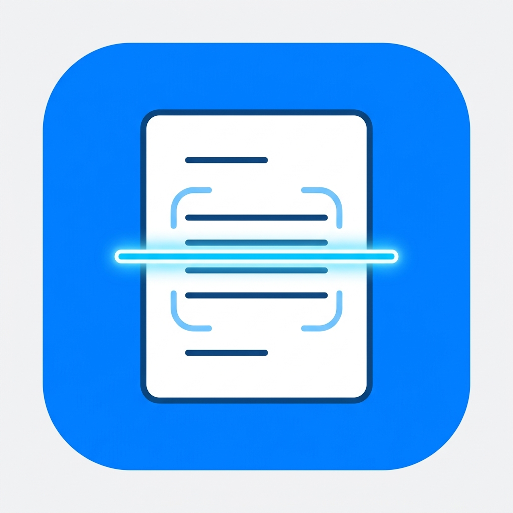

<p align="center">
  
</p>

<h1 align="center">📄 ScanAja</h1>

<p align="center">
  <b>Aplikasi Pemindai Dokumen Pintar, Konversi Berkas, dan Tanda Tangan Digital Berbasis Flutter & Native Android (Kotlin) dengan Google ML Kit.</b>
</p>

<p align="center">
  <a href="https://github.com/arazzki/ScanAja/releases/latest/download/ScanAja.apk">
    
  </a>
  <a href="https://github.com/arazzki/ScanAja/releases">
    
  </a>
</p>

<p align="center">
  
  
  
  
  
</p>

---

## 📥 Unduh APK Langsung (Siap Pakai)

Anda tidak perlu meng-compile atau meng-install Flutter untuk mencoba aplikasi ini di perangkat Android Anda:
- 📲 **[Download ScanAja (ScanAja.apk)](https://github.com/arazzki/ScanAja/releases/latest/download/ScanAja.apk)** *(Ukuran: ~87MB)*
- 📑 Lihat riwayat rilis lengkap di halaman **[GitHub Releases](https://github.com/arazzki/ScanAja/releases)**.

---

## 📝 Riwayat Rilis (Changelog)

### v2.0.1 (Patch Update)
- **Dark Mode (Tema Gelap)**: Implementasi penuh Material 3 Dark Mode dengan *toggle* (Otomatis/Terang/Gelap).
- **Reorder Pages**: Fitur baru untuk mengatur ulang urutan halaman dokumen dengan geser (*drag-and-drop*).
- **Fix Tanda Tangan**: Menghilangkan garis biru (kotak seleksi) yang sebelumnya ikut tersimpan secara permanen pada gambar dokumen.
- **Optimasi Performa**: Menggeser (*drag*) tanda tangan kini 100% mulus tanpa *lag* berkat optimasi rendering komponen isolasi.

### v2.0.0 (Major Release)
- **Rombak Ulang Engine**: Menggunakan **Google ML Kit Document Scanner** & Text Recognition (On-Device).
- **Convert Hub**: Fitur baru untuk konversi banyak Gambar menjadi satu PDF, serta mengekstrak halaman PDF menjadi Gambar (JPG).
- **Manajemen Folder**: Pengelompokan dokumen berdasarkan folder dinamis (buat, ubah nama, hapus) berbasis SQLite.
- **Tanda Tangan Digital (E-Sign)**: Penambahan fitur stempel tanda tangan kustom di atas dokumen.

---

## 📖 Tentang ScanAja

**ScanAja** adalah aplikasi *all-in-one* produktivitas dokumen modern yang dirancang untuk kecepatan, keakuratan, dan kenyamanan pengguna. Mengombinasikan kekuatan antarmuka **Flutter** yang modern dan performa pemrosesan gambar tingkat rendah dari **Native Android (Kotlin)** via **Google ML Kit Document Scanner**, ScanAja menghadirkan pengalaman digitalisasi berkas tanpa ribet langsung dari perangkat Anda.

Seluruh proses pemindaian dan pengenalan teks (OCR) berjalan **100% On-Device (Offline)** tanpa mengirim dokumen Anda ke server eksternal, menjamin privasi dan keamanan berkas penting Anda.

---

## ✨ Fitur Unggulan

### 1. 📸 Smart Scan (Google ML Kit On-Device)
- **Deteksi Tepi Otomatis (*Auto-Crop*)**: Mengidentifikasi sudut dan batas lembaran kertas secara presisi.
- **Koreksi Perspektif**: Meluruskan foto dokumen yang diambil dari sudut miring secara otomatis.
- **Pembersihan Noda & Bayangan**: Menghilangkan bayangan tangan dan noda untuk hasil pindaian tajam.
- **Filter Warna Bawaan**: Original, Grayscale, Black & White, dan Magic Color.
- **Multi-Page Scanning**: Pindai banyak halaman sekaligus dalam satu sesi dan gabungkan dalam satu dokumen.

### 2. ✍️ Tanda Tangan Digital (E-Sign)
- **Canvas Tanda Tangan**: Kanvas responsif dengan berbagai pilihan warna tinta (Hitam, Biru Tua, Biru Terang, Merah).
- **Stempel Dokumen Interaktif**: Tempatkan tanda tangan di atas lembaran dokumen, geser (*drag & drop*), dan atur ukurannya (*resizing slider*) sebelum disimpan permanen.

### 3. 🔄 Convert Hub (Konversi Berkas)
- **Gambar (Galeri) ➜ PDF**: Pilih satu atau beberapa foto dari galeri HP, atur urutan halaman, dan konversikan menjadi file PDF berkualitas tinggi.
- **PDF ➜ Gambar (JPG)**: Ekstrak seluruh halaman dari dokumen PDF apa pun menjadi file foto JPG resolusi tinggi secara instan.

### 4. 📝 Text Recognition (OCR)
- Ekstraksi teks otomatis dari hasil scan menggunakan **Google ML Kit Text Recognition**.
- Teks hasil deteksi dapat langsung disalin (*copy to clipboard*) untuk kebutuhan salin-tempel catatan atau dokumen.

### 5. 📁 Manajemen & Filter Folder
- Kelompokkan dokumen ke dalam folder kustom (*Pribadi*, *Kantor*, *Struk/Invoice*, dsb).
- Opsi **Rename Folder** dan **Hapus Folder** yang terintegrasi dengan database lokal.
- Filter dokumen berbasis tab horizontal dan pencarian (*search*) cepat berbasis judul, teks OCR, dan nama folder.

### 6. 📄 Ekspor & Berbagi PDF Bersih
- Gabungkan seluruh lembaran dokumen menjadi satu file PDF yang rapi.
- **100% Bebas Watermark**: Hasil ekspor dokumen bersih dan profesional.
- Integrasi tombol *Share* langsung ke WhatsApp, Telegram, Email, atau Google Drive.

### 7. 🎨 Desain Modern & Responsif (Material 3)
- Palet warna profesional (*Deep Indigo & Slate*).
- Kartu dokumen dengan sudut membulat, bayangan lembut, badge jumlah halaman, dan menu konteks yang intuitif.

---

## 🛠️ Arsitektur & Teknologi

| Lapisan / Komponen | Teknologi | Deskripsi |
|---|---|---|
| **Framework UI** | Flutter (Dart) | Antarmuka pengguna responsif berbasis Material 3 |
| **Native Bridge** | Android (Kotlin) | Komunikasi via `MethodChannel` (`com.example.scanaja/scanner`) |
| **Scanner Engine** | Google ML Kit Document Scanner | Deteksi tepi, auto-crop, filter, dan perataan perspektif |
| **OCR Engine** | Google ML Kit Text Recognition | Ekstraksi teks otomatis dari gambar secara lokal |
| **Local Database** | SQLite (`sqflite`) | Penyimpanan metadata dokumen, lembaran halaman, dan folder |
| **PDF Engine** | `pdf` & `pdfx` | Pembuatan PDF dan ekstraksi halaman PDF ke JPG |
| **File Picker** | `image_picker` & `file_picker` | Impor foto galeri dan dokumen PDF dari penyimpanan |

---

## 📂 Struktur Direktori Proyek

```plaintext
ScanAja/
├── android/                     # Kode Native Android (Kotlin, Gradle, Manifest)
│   └── app/src/main/kotlin/
│       └── com/example/scanaja/
│           └── MainActivity.kt  # MethodChannel & ML Kit Document Scanner
├── assets/                      # Asset statis & icon aplikasi
│   └── app_icon.jpg
├── lib/                         # Kode Utama Flutter
│   ├── models/                  # Model data (Document, DocumentPage, Folder)
│   │   ├── document_model.dart
│   │   └── folder_model.dart
│   ├── screens/                 # Layar UI Aplikasi
│   │   ├── convert_screen.dart
│   │   ├── document_detail_screen.dart
│   │   ├── home_screen.dart
│   │   ├── sign_document_screen.dart
│   │   └── signature_pad_screen.dart
│   ├── services/                # Logika bisnis & integrasi
│   │   ├── conversion_service.dart
│   │   ├── database_helper.dart
│   │   ├── pdf_service.dart
│   │   └── scanner_service.dart
│   └── main.dart                # Entry point & konfigurasi tema
├── pubspec.yaml                 # Dependensi Flutter
└── README.md                    # Dokumentasi Proyek
```

---

## 🚀 Cara Menjalankan & Membangun APK

### Prasyarat
- [Flutter SDK](https://flutter.dev/docs/get-started/install) (versi 3.20.0 atau lebih baru).
- [Android Studio](https://developer.android.com/studio) dengan Android SDK (API Level 21+).
- Perangkat fisik Android (disarankan untuk menguji fitur kamera Google ML Kit).

### 1. Clone Repositori
```bash
git clone https://github.com/arazzki/ScanAja.git
cd ScanAja
```

### 2. Pasang Dependensi
```bash
flutter pub get
```

### 3. Jalankan Aplikasi (Debug)
Hubungkan HP Android Anda via kabel USB (aktifkan USB Debugging):
```bash
flutter run
```

### 4. Build APK Rilis (Release)
Untuk membuat file mentahan `.apk` siap install di HP:
```bash
flutter build apk --release
```
File APK rilis akan dihasilkan di:
```plaintext
build/app/outputs/flutter-apk/ScanAja.apk
```

---

## 🔒 Privasi & Keamanan

ScanAja mengutamakan privasi pengguna:
- **On-Device Machine Learning**: Pemrosesan gambar, deteksi sudut dokumen, dan ekstraksi teks dilakukan sepenuhnya di perangkat Anda menggunakan Google Play Services.
- **Tanpa Pengiriman Data**: Dokumen dan tanda tangan Anda tidak pernah diunggah ke server cloud pihak ketiga tanpa persetujuan Anda saat membagikannya secara manual.

---

## 📄 Lisensi

Proyek ini dibuat dan dikembangkan di bawah lisensi [MIT License](LICENSE). Silakan gunakan, pelajari, dan kembangkan lebih lanjut!

<p align="center">
  Dibuat dengan ❤️ untuk kemudahan digitalisasi dokumen harian.
</p>
